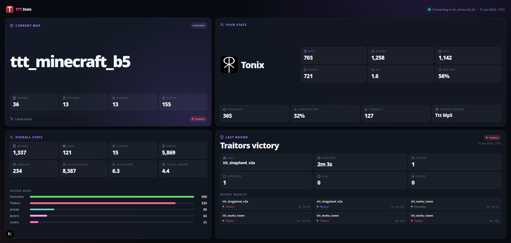

# TTT Stats

A statistics website and loading screen for Trouble in Terrorist Town 2. Rounds are collected by the companion [TTT2 Stats addon](https://github.com/WieseChristoph/ttt2-stats-addon), stored in PostgreSQL, and enriched with Steam names and avatars cached in Redis.



The website provides an overall dashboard, searchable map and player histories, detailed round event feeds, and a fixed-size `/loading` view for Garry's Mod loading screens.

## Development

Requirements: Node.js 24, pnpm 11, and Docker with Compose.

```bash
cp .env.example .env
docker compose -f docker-compose.dev.yml up -d
pnpm install
pnpm db:migrate
pnpm dev
```

Before starting, set `STEAM_API_KEY` and replace `STATS_INGEST_TOKEN` in `.env`. The ingest token must match the addon's `token`. The app is available at <http://localhost:3000>.

Useful checks:

```bash
pnpm tscheck
pnpm fix:all
pnpm build
```

## Docker deployment

The production Compose stack includes the Next.js app, PostgreSQL, Redis, and a one-shot migration container:

```bash
cp .env.example .env
# Set secure database and ingest credentials, plus a Steam Web API key.
docker compose up -d --build
```

Database migrations run before the app starts. `APP_PORT` controls the exposed port and defaults to `3000`. Put the app behind an HTTPS reverse proxy for a public deployment.

Configure the [TTT2 Stats addon](https://github.com/WieseChristoph/ttt2-stats-addon) with this deployment URL and the same `STATS_INGEST_TOKEN`. For the loading screen, use:

```text
https://stats.example.com/loading?mapname=%m&steamid=%s
```
